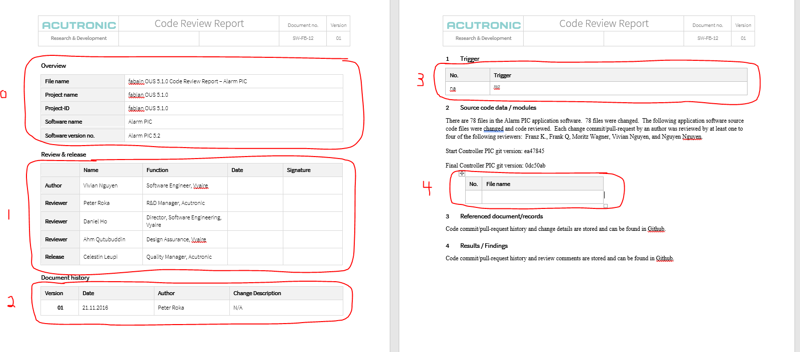

# Code Review Table Script

## Getting Started
These are the instructions to get the Code Review Table Script Project up and running.

### Installing Packages
Built using Python 32 bit 3.7.2

### Overview
This script will update the tables in the code review document 

## Generating the Stats Files and Running the Program
To generate the stats files we need to:
1. Clone the repository
2. cd into the repository
3. Run either of the below commands (Depending on what you want the output to be)
```
git diff --stat "COMMIT SHA 1" "COMMIT SHA 2" > stats.txt

git diff --stat "COMMIT SHA 1" "COMMIT SHA 2" '*.c' '*.h' '*.cpp' '*.rc' '*.rc2' '*.H' '*.C' > stats.txt
```
4. Update the corresponding variables (Example below)
```
stats_file_location = "C:\\Directory1\\Directory2\\fabian-gui\\FabianEvo\\stats.txt"
document_file_location = "C:\\Directory1\\Directory2\\Code-Review-Report.docx"
document_file_save_location = "C:\\Directory1\\Directory2\\Code-Review-Report-output.docx"
```
5. Update the counter you want the table to start at
```
start_counter = 1
```
6. Delete the table that you want to update with the exception of the first line which contains "No" and "Filename" and keep one line empty
7. Update the table counter which specifies the table to update
```
table_counter = 4
```
How do we find the table to update specifically? The image below shows how a table is indexed:

8. Run the program
```
python reader_main.py
```